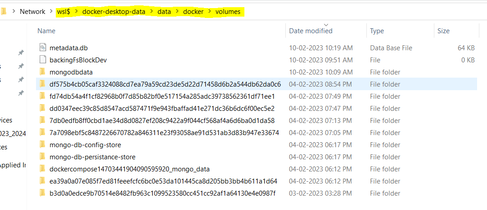

# Services Catalog

.NET 7 Web API for Small Microservices Solution

## Dotnet Commands

```dotnetcli
dotnet new webapi -n Catalog.API
```

## Docker Commands

```dockerfile
docker run -d --rm --name store-mongo -p 27017:27017 -v mongo-db-persistance-store:/data/db -v mongo-db-config-store:/data/configdb mongo
```

## Physical Path

`\\wsl$\docker-desktop-data\data\docker\volumes`


